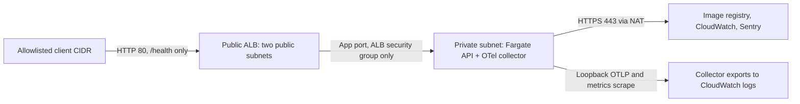

# devops-intern-otel-terraform-docker

A DevOps intern evidence project: a TypeScript Express API, a tested Docker observability stack, and Terraform for an AWS VPC and private ECS Fargate service.

This directory is self-contained inside the existing TLDR repository. Its two GitHub Actions workflows live in the parent `.github/workflows/`. If moving this project into its own repository, move those workflows too and remove the `devops-intern-otel-terraform-docker/` path prefixes and default working directories.

## Run locally

Prerequisites: Node.js 24, Docker with Compose v2, and Terraform 1.16.2 for infrastructure checks. Run commands from this directory. Examples use Bash; quote Terraform arguments containing `=` when using PowerShell.

```sh
npm ci --ignore-scripts
npm run lint
npm run build
npm test
docker compose up --build -d --wait
curl --fail http://localhost:3000/health
```

`/health` returns `{"status":"ok"}` and an `x-trace-id` response header. The production image uses a multi-stage build, production dependencies only, a non-root user, a health check, and bounded graceful shutdown. Compose adds a read-only filesystem and drops Linux capabilities. All published local ports bind to loopback.

| Local endpoint | Evidence |
| --- | --- |
| `http://localhost:3000/metrics` | prom-client request counts, latency histogram, and process metrics |
| `http://localhost:9090` | Prometheus; query `http_requests_total{route="/health"}` |
| `http://localhost:16686` | Jaeger; select service `devops-intern-api` |
| `docker compose logs api collector` | Winston JSON logs and exported OTel logs with trace IDs |

The API manually creates OTel server spans and extracts W3C trace context. On each completed request it increments a Prometheus counter and an OTel counter, records latency and status, and writes a correlated Winston log. Route templates bound label cardinality; unknown URLs share `unmatched`. The OTel SDK sends traces, metrics and logs to the collector using OTLP/HTTP. The collector sends traces to Jaeger, exposes OTel metrics to Prometheus, and writes logs to its output. Prometheus also directly scrapes `/metrics`.

Sentry captures handled API exceptions separately from the OTel trace provider. Set `SENTRY_DSN` in your environment to enable your own Sentry project. No real DSN is needed for tests: the test receiver checks actual Sentry envelopes. `/debug/error` exists only with `ENABLE_DEMO_ERRORS=true`; the default Compose stack and AWS deployment leave it disabled.

Stop the stack with `docker compose down --volumes`.

## Container integration evidence

```sh
docker compose -f compose.yaml -f compose.test.yaml up --build -d --wait api prometheus
docker compose -f compose.yaml -f compose.test.yaml run --rm integration
docker compose -f compose.yaml -f compose.test.yaml logs --no-color
docker compose -f compose.yaml -f compose.test.yaml down --volumes --remove-orphans
```

The runner uses a separate Node container and real HTTP calls to the API. It verifies health, counter increments, trace propagation, error spans, correlated log records, OTel metric export, Sentry delivery, and a successful Prometheus query. The collector forwards telemetry to a test-only HTTP evidence receiver; neither it nor the demo error route is deployed to AWS. Export checks retry for a bounded period and fail if any signal is absent.

Jest/Supertest unit tests also inspect in-memory OTel exports and error capture. Coverage thresholds apply to `app.ts` and `logger.ts`. `server.ts` and SDK exporter setup are exercised by the process/container suite. For machines without Docker, `npm run build && node scripts/test-local.mjs` checks SDK exports using two local processes; **that smoke check is not proof that Docker works** and does not include the collector or Prometheus.

## AWS architecture and boundaries



Terraform creates 33 resources: a VPC, two public and two private subnets across two AZs, an Internet gateway, route tables and associations, a NAT gateway and EIP, security groups and rules, an ALB and health-only listener rule, Fargate cluster/service/task, IAM roles, and a CloudWatch log group.

* The load balancer accepts port 80 only from `allowed_client_cidr`; `0.0.0.0/0` is rejected.
* Tasks have no public IP. Their only inbound rule allows `app_port` from the ALB security group. ALB egress is restricted to that task security group and port.
* Private default routes point to NAT; public routes point to the Internet gateway. Task egress allows HTTPS for image downloads, logging and Sentry. VPC DNS uses the Amazon resolver.
* Only `/health` is forwarded. `/metrics`, `/debug/error`, and all other paths receive a fixed 404 at the ALB. The collector scrapes metrics over task loopback and listens for OTLP on loopback.
* In AWS, collector debug output preserves traces, metrics, and logs in the seven-day CloudWatch log group. This is inspectable demonstration evidence, not a durable metrics database or a hosted trace-query UI. Local Compose provides Prometheus and Jaeger for querying.
* This small demo uses HTTP, one task and one NAT gateway. It does not promise HA or transport encryption for the public health response. NAT, ALB, Fargate, public IP and log ingestion incur charges while deployed. Destroy the stack when finished.

## Publish the app image

The infrastructure accepts a public image pinned by digest. Publish **this Dockerfile** to a public registry you control before planning a real deployment. No registry account is hard-coded or created by Terraform.

```sh
docker login
docker buildx build --platform linux/amd64 \
  --tag docker.io/YOUR_ACCOUNT/devops-intern-api:YOUR_COMMIT --push .
docker buildx imagetools inspect docker.io/YOUR_ACCOUNT/devops-intern-api:YOUR_COMMIT
```

Copy its digest into a reference such as `docker.io/YOUR_ACCOUNT/devops-intern-api@sha256:<digest>`. Ensure the repository is public; this deployment intentionally has no private registry credentials. Image validation rejects mutable tags. GHCR public images also work.

## Terraform deployment

Use AWS credentials authorized to manage the VPC, EC2 networking, ELB, ECS, IAM roles/policies and CloudWatch resources, including `iam:PassRole` for the task/execution roles. First use of ECS may require permission to create its service-linked role. No credentials are stored in this repository.

```sh
cp terraform/terraform.tfvars.example terraform/terraform.tfvars
# Edit the client IP/32, image digest, and (if changing region) both AZs.
terraform -chdir=terraform init -input=false -lockfile=readonly
terraform -chdir=terraform fmt -check -recursive
terraform -chdir=terraform validate
terraform -chdir=terraform test
terraform -chdir=terraform plan -out=deployment.tfplan
terraform -chdir=terraform show -json deployment.tfplan > terraform/plan.json
npm run test:network
terraform -chdir=terraform apply deployment.tfplan
terraform -chdir=terraform output -json > deployment-outputs.json
node scripts/check-deployment.mjs deployment-outputs.json
```

Run the deployment check from the allowlisted public IP. `app_url` is the `/health` URL; outputs also include the VPC, public/private subnets, both security groups, app port, allowed CIDR, ECS service/cluster and log group. The deployment check proves `/health` succeeds and `/metrics` is blocked at the ALB. From an address outside the CIDR, `curl --connect-timeout 5 <app_url>` should fail to connect. Inspect the output SG IDs in AWS to confirm the deployed rule relationship.

```sh
aws logs tail "$(terraform -chdir=terraform output -raw log_group_name)" --since 10m
terraform -chdir=terraform destroy
```

Optional Sentry: create a Secrets Manager secret whose entire string value is the DSN, and supply its ARN via `sentry_secret_arn`. ECS injects it at startup; the execution role receives permission to read only that secret. Use the AWS-managed Secrets Manager encryption key; a custom KMS key needs an additional decrypt policy. The DSN itself is never placed in Terraform variables or the plan. Without this ARN, AWS Sentry export is disabled.

The default backend is local for a single operator. Keep state private and do not lose it. CI's real plan uses an **existing** encrypted, versioned S3 state bucket with public access blocked and S3 locking. Use the same bucket/key/backend for all later plan/apply/destroy operations on that deployment. Never manage one stack from independent local and remote states.

## CI: two distinct kinds of plan

`devops-intern-ci.yml` runs on relevant pushes/PRs and manual dispatch:

1. Installs locked dependencies, runs lint/type checks, builds TypeScript and runs Jest with coverage.
2. Builds the production Docker image, starts the default stack, checks health/non-root execution, then runs the full container integration suite. It uploads container logs and received telemetry and tears down the stack on failure too.
3. Runs Terraform formatting, initialization, validation, mocked tests, a **credential-free speculative plan**, and assertions against its JSON. It uploads readable plan artifacts. This job uses a deliberately fake image and credentials and cannot establish deployment readiness. Do not apply it.

`devops-intern-aws-plan.yml` is a manually dispatched, authenticated workflow. Every step is mandatory; absent configuration fails the run. Configure the `aws-plan` GitHub environment with:

| Environment variable | Value |
| --- | --- |
| `AWS_PLAN_ROLE_ARN` | Existing AWS role trusted through GitHub OIDC for this repository's `aws-plan` environment |
| `TF_STATE_BUCKET` | Existing encrypted/versioned S3 state bucket in `us-east-1` |
| `SENTRY_SECRET_ARN` | Optional DSN secret ARN |

The OIDC trust should restrict `aud` to `sts.amazonaws.com` and `sub` to `repo:OWNER/REPOSITORY:environment:aws-plan`. The role needs resource read permissions for refresh plus bucket state read and lock-object read/write/delete permissions. If no ECS service-linked role exists, the applying identity must be able to create it. Apply uses a separately authorized identity with the create/update/delete permissions above.

Supply the real image digest and client CIDR as dispatch inputs. The workflow verifies that the image is pullable for Linux AMD64, initializes the S3 backend, validates/tests, and saves an authenticated binary plan with its readable version and backend definition. Artifacts expire after three days. Review the readable plan, then apply the downloaded binary using Terraform 1.16.2, the same checkout/provider lockfile, AWS account, and backend configuration. Reinitialize with the same bucket, key `devops-intern/terraform.tfstate`, region `us-east-1`, `encrypt=true`, and `use_lockfile=true`. Run a fresh plan if the state or image/configuration changed. No workflow automatically applies resources.

Plan files can contain infrastructure details and must be handled as private artifacts. The real workflow is configured for `us-east-1`; change its region and Terraform AZ inputs together for another region.

## Verification record

Implemented and locally verified: clean `npm ci --ignore-scripts`, TypeScript build, lint, three Jest tests (100% line/statement coverage for API/logger), process-level OTLP/Sentry export smoke test, valid Compose/YAML configuration, Terraform init/validate/fmt, four mocked network/validation tests, and a 33-resource speculative plan with network assertions. Six plan-checker regression tests reject unsafe edits and allow valid refreshed security-group state.

The container suite and authenticated apply-ready AWS plan must still be run in a working Docker/CI environment with a published app image. No infrastructure has been applied and no live URL or passing GitHub run is claimed by this record. The workflow artifacts and post-apply check provide the remaining evidence.

References: [OpenTelemetry Node SDK](https://open-telemetry.github.io/opentelemetry-js/interfaces/_opentelemetry_sdk-node.NodeSDKConfiguration.html), [AWS Fargate networking](https://docs.aws.amazon.com/AmazonECS/latest/developerguide/fargate-task-networking.html).
